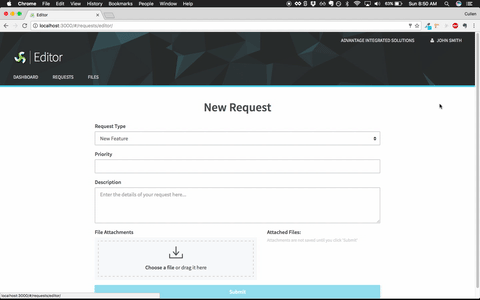

# Angular Demo App

Angular 1.5 application used as a reference tool or to jumpstart new QuickBase projects.

### Features
- Component-based architecture
- User authentication
- Drag and drop file uploads
- CRUD actions on multiple entities
- ES6, Sass, and a build process built on Gulp
- Sensible routing via UI Router
- Backed by a QuickBase database

